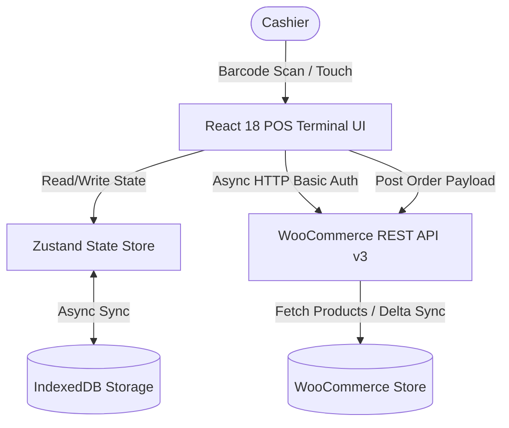

# ⚡ WooCommerce Point of Sale (POS) Terminal


A high-performance, minimalist, client-side Point of Sale (POS) web terminal engineered to connect directly to any WooCommerce store via REST API v3. Designed for speed, offline-first reliability, and seamless cashier workflows.

---

## ✨ Key Features

* 🚀 **Concurrent Catalog Synchronization:** Uses parallel request orchestration (`Promise.all` + `X-WP-TotalPages`) to fetch large catalog data in ~1–2 seconds instead of traditional 15s+ sequential fetching.
* 💾 **Unlimited Offline Caching:** Bypasses `localStorage` 5MB quota restrictions by leveraging **IndexedDB** (`idb-keyval`) wrapped inside **Zustand** store persistence.
* 🔍 **Real-Time Barcode & SKU Search:** Native barcode scanning support mapped directly to WooCommerce product SKUs with instant product modal popups for variable products.
* ⚡ **Delta Stock Sync:** Features targeted "Sync Stock" (delta sync) and full "Sync Inventory" catalog rebuild modes to minimize server load.
* ⌨️ **Cashier Hotkeys:** Optimized keyboard shortcuts (`F1` Search, `F2` Cash Payment, `F3` Bank Transfer, `F9` Checkout) for rapid transaction processing.
* 🧾 **Instant Order Checkout & Receipts:** Direct POST execution to `/wc/v3/orders` with automated fee calculations, negative fee discount injections, and barcode receipt rendering.
* 🎨 **Ultra-Clean Dark Mode UI:** Bespoke inline CSS tokenized design system (`T.surface`, `T.accent`) engineered for low eye-strain in high-volume retail environments.

---

## 🛠️ Tech Stack

| Component | Technology | Description |
| :--- | :--- | :--- |
| **Frontend Core** | [React 18](https://react.dev/) + [Vite 5](https://vitejs.dev/) | Single-Page Application (SPA) architecture with fast HMR |
| **State Engine** | [Zustand 5](https://github.com/pmndrs/zustand) | Ultra-fast client-side reactive store management |
| **Offline Storage**| [IndexedDB](https://developer.mozilla.org/en-US/docs/Web/API/IndexedDB_API) (`idb-keyval`) | Unlimited high-capacity asynchronous browser database |
| **Routing** | [React Router DOM v6](https://reactrouter.com/) | Lightweight client-side navigation |
| **HTTP Client** | [Axios](https://axios-http.com/) | Handles HTTP Basic Auth (`btoa`) and REST API payloads |
| **Barcodes** | `react-barcode` | Real-time barcode generation for printed and digital receipts |
| **PWA Engine** | `vite-plugin-pwa` | Web App Manifest & Service Worker capabilities |

---

## 🏗️ Architecture & Data Flow



---

## 📁 Project Structure

```text
POS/
├── src/
│   ├── api/          # WooCommerce REST API Client & HTTP interceptors
│   ├── components/   # Modular UI components (Layout, Modals, Receipt)
│   ├── hooks/        # Custom React hooks
│   ├── pages/        # Main terminal pages (Dashboard, PosTerminal, Login)
│   ├── store/        # Zustand state stores & IndexedDB persistence adapter
│   ├── utils/        # Helper functions & formatting utilities
│   ├── App.jsx       # Client routing & authentication guards
│   ├── index.css     # Design tokens & CSS reset
│   └── main.jsx      # Application entry point
├── dist/             # Production build distribution
├── index.html        # App HTML shell
├── vite.config.js    # Vite & PWA configuration
└── package.json      # Dependencies and build scripts
```

---

## ⌨️ Cashier Keyboard Shortcuts

| Shortcut | Action |
| :--- | :--- |
| <kbd>F1</kbd> | Focus Product Search / Barcode Input |
| <kbd>F2</kbd> | Select **Cash** Payment Method |
| <kbd>F3</kbd> | Select **Bank Transfer** Payment Method |
| <kbd>F9</kbd> | Complete & Execute Checkout |

---

## 🚀 Getting Started

### Prerequisites
* **Node.js** (v18 or higher)
* **npm** (v9 or higher)
* A running **WooCommerce Store** with REST API credentials (`Consumer Key` & `Consumer Secret`)

### 1. Installation

Clone the repository and install dependencies:

```bash
git clone https://github.com/ianasriaz/WooCommercePOS.git
cd WooCommercePOS
npm install
```

### 2. Running Locally

Start the local Vite development server:

```bash
npm run dev
```

Open your browser and navigate to `http://localhost:5173`. Enter your WooCommerce Store URL and API Keys on the Login screen to sync catalog data.

### 3. Build for Production

Generate an optimized production build:

```bash
npm run build
```

Preview the production build locally:

```bash
npm run preview
```

---

## 📄 License

Distributed under the MIT License. See `LICENSE` for more information.

---

<p align="center">
  Developed by <b>Anas Riaz</b> • <a href="https://www.anasriaz.com">anasriaz.com</a>
</p>
